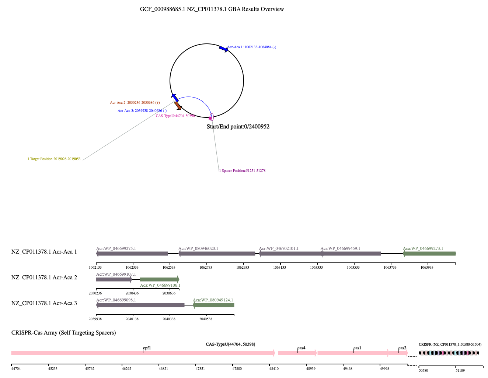

# Visualization Implementation for Acr-Aca interactions on gene circle and Crispr-Cas chain

Implemented in AcrDB website (https://bcb.unl.edu/AcrDB/) 

Example Page (https://bcb.unl.edu/AcrDB/anti_crispr_results.php?type=ncbi&organism=GCF_000015125.1)


## Visuzaltion Example

<!--  -->


## Citation

If you want to use this code for academic research, please cite us:

Le Huang, Bowen Yang, Haidong Yi, et al. AcrDB: a database of anti-CRISPR operons in prokaryotes and viruses. Nucleic Acids Res. 2021;49(D1):D622-D629. doi:10.1093/nar/gkaa857

```
@article{huang2021acrdb,
  title={AcrDB: a database of anti-CRISPR operons in prokaryotes and viruses},
  author={Huang, Le and Yang, Bowen and Yi, Haidong and Asif, Amina and Wang, Jiawei and Lithgow, Trevor and Zhang, Han and Minhas, Fayyaz ul Amir Afsar and Yin, Yanbin},
  journal={Nucleic Acids Research},
  volume={49},
  number={D1},
  pages={D622--D629},
  year={2021},
  publisher={Oxford University Press}
}
```